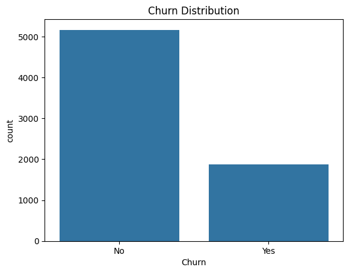
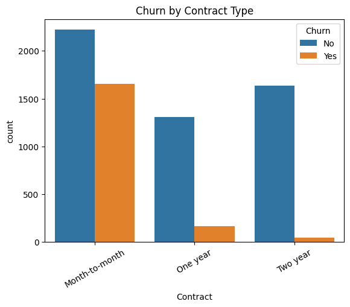
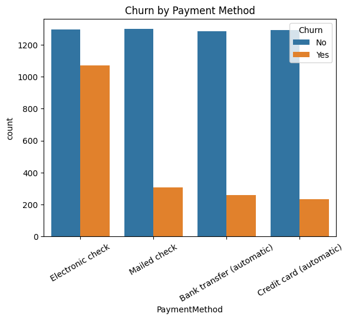
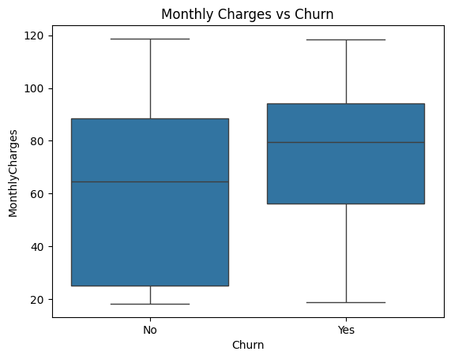
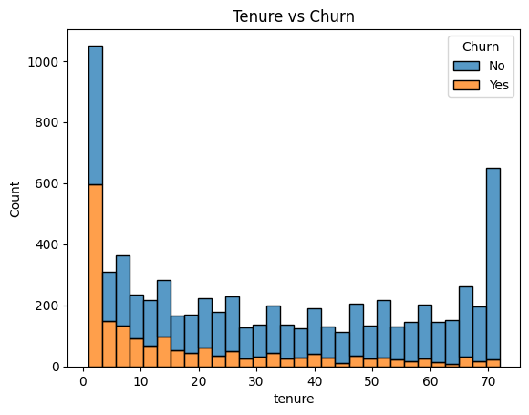

# 📊 Customer Churn Prediction Using Logistic Regression and Model Comparison on Telco Data

## 🧠 Objective
To analyze customer behavior, identify factors that contribute to churn, and build predictive models to classify whether a customer is likely to churn or not. The project also compares multiple machine learning algorithms to select the most effective model.

## ❓ Problem Statement
Customer churn is a critical issue in the telecom industry. Losing customers can significantly impact revenue. This project uses data analysis and machine learning to understand the drivers of churn and provide a predictive solution that helps businesses take proactive measures.

---

## 📂 Dataset Overview
- **Source**: [Kaggle - Telco Customer Churn](https://www.kaggle.com/datasets/blastchar/telco-customer-churn)  
- **Rows**: 7043  
- **Columns**: 21  
- **Target Variable**: `Churn (Yes/No)`

---

## 🔧 Step 1: Data Cleaning
- Converted `'TotalCharges'` to numeric.
- Dropped 11 rows with missing `'TotalCharges'`.
- Removed `'customerID'` as it’s not relevant for modeling.

---

## 📊 Step 2: Exploratory Data Analysis (EDA)
Charts created using **Seaborn** and **Matplotlib**:

-   
-   
-   
-   
-   

 

### 🔍 Insights from EDA:
- Month-to-month contracts are risky for churn.
- Electronic check payment increases churn likelihood.
- New customers (<10 months tenure) are more likely to churn.
- High monthly charges are linked to increased churn risk.

---

## 🧱 Step 3: Feature Encoding
- Encoded `Churn` using **Label Encoding**.
- Applied **One-Hot Encoding** to categorical features.

---

## 🤖 Step 4: Model Building and Comparison

### Models Trained:
- Logistic Regression  
- Decision Tree  
- Random Forest  
- K-Nearest Neighbors (KNN)  
- Support Vector Machine (SVM)

> **Preprocessing**:  
> - Features scaled using `StandardScaler`  
> - Data split: 80% training / 20% testing  

---

### 📈 Model Evaluation & Results:
| Model               | Accuracy     |
|---------------------|--------------|
| Logistic Regression | **78.75%**   |
| Decision Tree       | 72.21%       |
| Random Forest       | 78.39%       |
| KNN                 | 75.27%       |
| SVM                 | 78.11%       |

- 

### 🧠 Evaluation Insights:
- **Logistic Regression** had the best balance of precision & recall.
- **Decision Tree** struggled with class imbalance.
- **Random Forest** performed well but had slightly lower recall for churners.
- **KNN** showed moderate performance with better balance than Decision Tree.
- **SVM** offered balanced results similar to Logistic Regression.

---

## 📁 Final Predictions
- Final predictions exported from the **Logistic Regression model**.
- Output saved as: `Churn_Cleaned_For_PowerBI.csv`
- Used for **Power BI dashboard visualization**.

---

## 💡 Business Recommendations
- Encourage customers to opt for long-term contracts (1–2 years).
- Offer incentives for using auto-pay methods.
- Improve onboarding for new users to reduce early churn.
- Monitor high-bill customers with churn risk alerts.

---

## ✅ Conclusion
This project provided a comprehensive analysis of customer churn in the telecom industry. While Random Forest, SVM, and Logistic Regression showed similar accuracy, Logistic Regression offered a better trade-off between performance metrics. These insights, along with visualizations and predictions, empower stakeholders to take **data-driven decisions** for customer retention.

---

## 🚀 Tools & Technologies Used
- Python (Pandas, NumPy, Matplotlib, Seaborn, Scikit-learn)
- Jupyter Notebook
- Power BI (for dashboard visualization)

---
